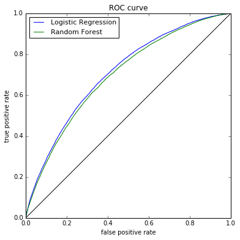

# Lending Club Loan Data Analysis
## Prediction the "Charged-Off" loan status

by James Alikhani   
October 2017    


In this machine learning practice, from [Kaggle] (https://www.kaggle.com/wendykan/lending-club-loan-data), I have used Python to load the loan data, clean the data, prepare the data for classification aalgorithm, and finally applied scikit-learn tool for the classification predictive models with metric analysis. 
The goal of this practice is to build and train a predictive model over real-world data that can predict the loan borrowers with a high chance of not fully pay off their loan that is called "Charged Off" status. This helps investors to reduce their risk of financial investment. 


```python
import numpy as np
import pandas as pd
import sqlite3
import matplotlib.pylab as plt
%matplotlib inline
```


```python
to_parse_as_date = ['issue_d', 'earliest_cr_line', 'last_pymnt_d', 'next_pymnt_d', 'last_credit_pull_d']
df = pd.read_csv('loan.csv', low_memory = False, parse_dates = to_parse_as_date)
```


```python
print('The shape is {}'.format(df.shape))
print('Memory : {} Mb'.format(int(df.memory_usage(deep=False).sum() / 1000000)))
```

    The shape is (887379, 74)
    Memory : 525 Mb


```python
df.head()
```


<div>
<table border="1" class="dataframe">
  <thead>
    <tr style="text-align: right;">
      <th></th>
      <th>id</th>
      <th>member_id</th>
      <th>loan_amnt</th>
      <th>funded_amnt</th>
      <th>funded_amnt_inv</th>
      <th>term</th>
      <th>int_rate</th>
      <th>installment</th>
      <th>grade</th>
      <th>sub_grade</th>
      <th>...</th>
      <th>total_bal_il</th>
      <th>il_util</th>
      <th>open_rv_12m</th>
      <th>open_rv_24m</th>
      <th>max_bal_bc</th>
      <th>all_util</th>
      <th>total_rev_hi_lim</th>
      <th>inq_fi</th>
      <th>total_cu_tl</th>
      <th>inq_last_12m</th>
    </tr>
  </thead>
  <tbody>
    <tr>
      <th>0</th>
      <td>1077501</td>
      <td>1296599</td>
      <td>5000</td>
      <td>5000</td>
      <td>4975</td>
      <td>36 months</td>
      <td>10.65</td>
      <td>162.87</td>
      <td>B</td>
      <td>B2</td>
      <td>...</td>
      <td>NaN</td>
      <td>NaN</td>
      <td>NaN</td>
      <td>NaN</td>
      <td>NaN</td>
      <td>NaN</td>
      <td>NaN</td>
      <td>NaN</td>
      <td>NaN</td>
      <td>NaN</td>
    </tr>
    <tr>
      <th>1</th>
      <td>1077430</td>
      <td>1314167</td>
      <td>2500</td>
      <td>2500</td>
      <td>2500</td>
      <td>60 months</td>
      <td>15.27</td>
      <td>59.83</td>
      <td>C</td>
      <td>C4</td>
      <td>...</td>
      <td>NaN</td>
      <td>NaN</td>
      <td>NaN</td>
      <td>NaN</td>
      <td>NaN</td>
      <td>NaN</td>
      <td>NaN</td>
      <td>NaN</td>
      <td>NaN</td>
      <td>NaN</td>
    </tr>
    <tr>
      <th>2</th>
      <td>1077175</td>
      <td>1313524</td>
      <td>2400</td>
      <td>2400</td>
      <td>2400</td>
      <td>36 months</td>
      <td>15.96</td>
      <td>84.33</td>
      <td>C</td>
      <td>C5</td>
      <td>...</td>
      <td>NaN</td>
      <td>NaN</td>
      <td>NaN</td>
      <td>NaN</td>
      <td>NaN</td>
      <td>NaN</td>
      <td>NaN</td>
      <td>NaN</td>
      <td>NaN</td>
      <td>NaN</td>
    </tr>
    <tr>
      <th>3</th>
      <td>1076863</td>
      <td>1277178</td>
      <td>10000</td>
      <td>10000</td>
      <td>10000</td>
      <td>36 months</td>
      <td>13.49</td>
      <td>339.31</td>
      <td>C</td>
      <td>C1</td>
      <td>...</td>
      <td>NaN</td>
      <td>NaN</td>
      <td>NaN</td>
      <td>NaN</td>
      <td>NaN</td>
      <td>NaN</td>
      <td>NaN</td>
      <td>NaN</td>
      <td>NaN</td>
      <td>NaN</td>
    </tr>
    <tr>
      <th>4</th>
      <td>1075358</td>
      <td>1311748</td>
      <td>3000</td>
      <td>3000</td>
      <td>3000</td>
      <td>60 months</td>
      <td>12.69</td>
      <td>67.79</td>
      <td>B</td>
      <td>B5</td>
      <td>...</td>
      <td>NaN</td>
      <td>NaN</td>
      <td>NaN</td>
      <td>NaN</td>
      <td>NaN</td>
      <td>NaN</td>
      <td>NaN</td>
      <td>NaN</td>
      <td>NaN</td>
      <td>NaN</td>
    </tr>
  </tbody>
</table>
<p>5 rows × 74 columns</p>
</div>


```python
# droping the redundant features (with arrying possibly no information!)
delete_me = ['id', 'member_id', 'url', 'zip_code']
df.drop(delete_me, axis=1, inplace=True)
```


```python
# missing data analysis
clmns_lst = df.columns
print('% of missing data in each column:')
miss_lst = df.isnull().sum(axis=0)/len(df)*100
print(miss_lst)
```

    % of missing data in each column:
    loan_amnt                       0.000000
    funded_amnt                     0.000000
    funded_amnt_inv                 0.000000
    term                            0.000000
    int_rate                        0.000000
    installment                     0.000000
    grade                           0.000000
    sub_grade                       0.000000
    emp_title                       5.798762
    emp_length                      0.000000
    home_ownership                  0.000000
    annual_inc                      0.000451
    verification_status             0.000000
    issue_d                         0.000000
    loan_status                     0.000000
    pymnt_plan                      0.000000
    desc                           85.797613
    purpose                         0.000000
    title                           0.017016
    addr_state                      0.000000
    dti                             0.000000
    delinq_2yrs                     0.003268
    earliest_cr_line                0.003268
    inq_last_6mths                  0.003268
    mths_since_last_delinq         51.197065
    mths_since_last_record         84.555303
    open_acc                        0.003268
    pub_rec                         0.003268
    revol_bal                       0.000000
    revol_util                      0.056571
                                     ...    
    collection_recovery_fee         0.000000
    last_pymnt_d                    1.990018
    last_pymnt_amnt                 0.000000
    next_pymnt_d                   28.507661
    last_credit_pull_d              0.005973
    collections_12_mths_ex_med      0.016340
    mths_since_last_major_derog    75.015974
    policy_code                     0.000000
    application_type                0.000000
    annual_inc_joint               99.942415
    dti_joint                      99.942640
    verification_status_joint      99.942415
    acc_now_delinq                  0.003268
    tot_coll_amt                    7.919502
    tot_cur_bal                     7.919502
    open_acc_6m                    97.591559
    open_il_6m                     97.591559
    open_il_12m                    97.591559
    open_il_24m                    97.591559
    mths_since_rcnt_il             97.654892
    total_bal_il                   97.591559
    il_util                        97.902024
    open_rv_12m                    97.591559
    open_rv_24m                    97.591559
    max_bal_bc                     97.591559
    all_util                       97.591559
    total_rev_hi_lim                7.919502
    inq_fi                         97.591559
    total_cu_tl                    97.591559
    inq_last_12m                   97.591559
    dtype: float64


```python
# dropping features with more than 50% filled with NA values:
delete_me = []
for i, miss_val in enumerate(miss_lst):    
    if miss_val > 50:  # delete attributes with more than 50% missing data
        delete_me.append(clmns_lst[i]) 
        
df.drop(delete_me, axis=1, inplace=True)
```


```python
clmns_lst = df.columns
print('% of missing data in each column (after first trimming): ')
miss_lst = df.isnull().sum(axis=0)/len(df)*100
print(miss_lst)
```

    % of missing data in each column (after first trimming): 
    loan_amnt                      0.000000
    funded_amnt                    0.000000
    funded_amnt_inv                0.000000
    term                           0.000000
    int_rate                       0.000000
    installment                    0.000000
    grade                          0.000000
    sub_grade                      0.000000
    emp_title                      5.798762
    emp_length                     0.000000
    home_ownership                 0.000000
    annual_inc                     0.000451
    verification_status            0.000000
    issue_d                        0.000000
    loan_status                    0.000000
    pymnt_plan                     0.000000
    purpose                        0.000000
    title                          0.017016
    addr_state                     0.000000
    dti                            0.000000
    delinq_2yrs                    0.003268
    earliest_cr_line               0.003268
    inq_last_6mths                 0.003268
    open_acc                       0.003268
    pub_rec                        0.003268
    revol_bal                      0.000000
    revol_util                     0.056571
    total_acc                      0.003268
    initial_list_status            0.000000
    out_prncp                      0.000000
    out_prncp_inv                  0.000000
    total_pymnt                    0.000000
    total_pymnt_inv                0.000000
    total_rec_prncp                0.000000
    total_rec_int                  0.000000
    total_rec_late_fee             0.000000
    recoveries                     0.000000
    collection_recovery_fee        0.000000
    last_pymnt_d                   1.990018
    last_pymnt_amnt                0.000000
    next_pymnt_d                  28.507661
    last_credit_pull_d             0.005973
    collections_12_mths_ex_med     0.016340
    policy_code                    0.000000
    application_type               0.000000
    acc_now_delinq                 0.003268
    tot_coll_amt                   7.919502
    tot_cur_bal                    7.919502
    total_rev_hi_lim               7.919502
    dtype: float64


```python
# checking for 'next_pymnt_d' column with 28.5% NA values:
df['next_pymnt_d'][1:10]
```


    1          NaT
    2          NaT
    3          NaT
    4   2016-02-01
    5          NaT
    6   2016-02-01
    7          NaT
    8          NaT
    9          NaT
    Name: next_pymnt_d, dtype: datetime64[ns]


```python
# next_pymnt_d:Next scheduled payment date
# It seems there is not much of information in this attribute to keep it 
# and delete 29% of rows, therefore, it's better to dropped for now!
df.drop('next_pymnt_d', axis=1, inplace=True)
```


```python
# 'policy_code' attribute: 
df.groupby('policy_code').size()
```


    policy_code
    1    887379
    dtype: int64


```python
# 'policy_code' column is all = 1, no informataion, delete!
df.drop('policy_code', axis=1, inplace=True)
```


```python
print('The shape is {}'.format(df.shape))
```

    The shape is (887379, 47)


```python
pd.set_option('display.max_columns', 50)
df.head()
```


<div>
<table border="1" class="dataframe">
  <thead>
    <tr style="text-align: right;">
      <th></th>
      <th>loan_amnt</th>
      <th>funded_amnt</th>
      <th>funded_amnt_inv</th>
      <th>term</th>
      <th>int_rate</th>
      <th>installment</th>
      <th>grade</th>
      <th>sub_grade</th>
      <th>emp_title</th>
      <th>emp_length</th>
      <th>home_ownership</th>
      <th>annual_inc</th>
      <th>verification_status</th>
      <th>issue_d</th>
      <th>loan_status</th>
      <th>pymnt_plan</th>
      <th>purpose</th>
      <th>title</th>
      <th>addr_state</th>
      <th>dti</th>
      <th>delinq_2yrs</th>
      <th>earliest_cr_line</th>
      <th>inq_last_6mths</th>
      <th>open_acc</th>
      <th>pub_rec</th>
      <th>revol_bal</th>
      <th>revol_util</th>
      <th>total_acc</th>
      <th>initial_list_status</th>
      <th>out_prncp</th>
      <th>out_prncp_inv</th>
      <th>total_pymnt</th>
      <th>total_pymnt_inv</th>
      <th>total_rec_prncp</th>
      <th>total_rec_int</th>
      <th>total_rec_late_fee</th>
      <th>recoveries</th>
      <th>collection_recovery_fee</th>
      <th>last_pymnt_d</th>
      <th>last_pymnt_amnt</th>
      <th>last_credit_pull_d</th>
      <th>collections_12_mths_ex_med</th>
      <th>application_type</th>
      <th>acc_now_delinq</th>
      <th>tot_coll_amt</th>
      <th>tot_cur_bal</th>
      <th>total_rev_hi_lim</th>
    </tr>
  </thead>
  <tbody>
    <tr>
      <th>0</th>
      <td>5000</td>
      <td>5000</td>
      <td>4975</td>
      <td>36 months</td>
      <td>10.65</td>
      <td>162.87</td>
      <td>B</td>
      <td>B2</td>
      <td>NaN</td>
      <td>10+ years</td>
      <td>RENT</td>
      <td>24000</td>
      <td>Verified</td>
      <td>2011-12-01</td>
      <td>Fully Paid</td>
      <td>n</td>
      <td>credit_card</td>
      <td>Computer</td>
      <td>AZ</td>
      <td>27.65</td>
      <td>0</td>
      <td>1985-01-01</td>
      <td>1</td>
      <td>3</td>
      <td>0</td>
      <td>13648</td>
      <td>83.7</td>
      <td>9</td>
      <td>f</td>
      <td>0.0</td>
      <td>0.0</td>
      <td>5861.071414</td>
      <td>5831.78</td>
      <td>5000.00</td>
      <td>861.07</td>
      <td>0.00</td>
      <td>0.00</td>
      <td>0.00</td>
      <td>2015-01-01</td>
      <td>171.62</td>
      <td>2016-01-01</td>
      <td>0</td>
      <td>INDIVIDUAL</td>
      <td>0</td>
      <td>NaN</td>
      <td>NaN</td>
      <td>NaN</td>
    </tr>
    <tr>
      <th>1</th>
      <td>2500</td>
      <td>2500</td>
      <td>2500</td>
      <td>60 months</td>
      <td>15.27</td>
      <td>59.83</td>
      <td>C</td>
      <td>C4</td>
      <td>Ryder</td>
      <td>&lt; 1 year</td>
      <td>RENT</td>
      <td>30000</td>
      <td>Source Verified</td>
      <td>2011-12-01</td>
      <td>Charged Off</td>
      <td>n</td>
      <td>car</td>
      <td>bike</td>
      <td>GA</td>
      <td>1.00</td>
      <td>0</td>
      <td>1999-04-01</td>
      <td>5</td>
      <td>3</td>
      <td>0</td>
      <td>1687</td>
      <td>9.4</td>
      <td>4</td>
      <td>f</td>
      <td>0.0</td>
      <td>0.0</td>
      <td>1008.710000</td>
      <td>1008.71</td>
      <td>456.46</td>
      <td>435.17</td>
      <td>0.00</td>
      <td>117.08</td>
      <td>1.11</td>
      <td>2013-04-01</td>
      <td>119.66</td>
      <td>2013-09-01</td>
      <td>0</td>
      <td>INDIVIDUAL</td>
      <td>0</td>
      <td>NaN</td>
      <td>NaN</td>
      <td>NaN</td>
    </tr>
    <tr>
      <th>2</th>
      <td>2400</td>
      <td>2400</td>
      <td>2400</td>
      <td>36 months</td>
      <td>15.96</td>
      <td>84.33</td>
      <td>C</td>
      <td>C5</td>
      <td>NaN</td>
      <td>10+ years</td>
      <td>RENT</td>
      <td>12252</td>
      <td>Not Verified</td>
      <td>2011-12-01</td>
      <td>Fully Paid</td>
      <td>n</td>
      <td>small_business</td>
      <td>real estate business</td>
      <td>IL</td>
      <td>8.72</td>
      <td>0</td>
      <td>2001-11-01</td>
      <td>2</td>
      <td>2</td>
      <td>0</td>
      <td>2956</td>
      <td>98.5</td>
      <td>10</td>
      <td>f</td>
      <td>0.0</td>
      <td>0.0</td>
      <td>3003.653644</td>
      <td>3003.65</td>
      <td>2400.00</td>
      <td>603.65</td>
      <td>0.00</td>
      <td>0.00</td>
      <td>0.00</td>
      <td>2014-06-01</td>
      <td>649.91</td>
      <td>2016-01-01</td>
      <td>0</td>
      <td>INDIVIDUAL</td>
      <td>0</td>
      <td>NaN</td>
      <td>NaN</td>
      <td>NaN</td>
    </tr>
    <tr>
      <th>3</th>
      <td>10000</td>
      <td>10000</td>
      <td>10000</td>
      <td>36 months</td>
      <td>13.49</td>
      <td>339.31</td>
      <td>C</td>
      <td>C1</td>
      <td>AIR RESOURCES BOARD</td>
      <td>10+ years</td>
      <td>RENT</td>
      <td>49200</td>
      <td>Source Verified</td>
      <td>2011-12-01</td>
      <td>Fully Paid</td>
      <td>n</td>
      <td>other</td>
      <td>personel</td>
      <td>CA</td>
      <td>20.00</td>
      <td>0</td>
      <td>1996-02-01</td>
      <td>1</td>
      <td>10</td>
      <td>0</td>
      <td>5598</td>
      <td>21.0</td>
      <td>37</td>
      <td>f</td>
      <td>0.0</td>
      <td>0.0</td>
      <td>12226.302212</td>
      <td>12226.30</td>
      <td>10000.00</td>
      <td>2209.33</td>
      <td>16.97</td>
      <td>0.00</td>
      <td>0.00</td>
      <td>2015-01-01</td>
      <td>357.48</td>
      <td>2015-01-01</td>
      <td>0</td>
      <td>INDIVIDUAL</td>
      <td>0</td>
      <td>NaN</td>
      <td>NaN</td>
      <td>NaN</td>
    </tr>
    <tr>
      <th>4</th>
      <td>3000</td>
      <td>3000</td>
      <td>3000</td>
      <td>60 months</td>
      <td>12.69</td>
      <td>67.79</td>
      <td>B</td>
      <td>B5</td>
      <td>University Medical Group</td>
      <td>1 year</td>
      <td>RENT</td>
      <td>80000</td>
      <td>Source Verified</td>
      <td>2011-12-01</td>
      <td>Current</td>
      <td>n</td>
      <td>other</td>
      <td>Personal</td>
      <td>OR</td>
      <td>17.94</td>
      <td>0</td>
      <td>1996-01-01</td>
      <td>0</td>
      <td>15</td>
      <td>0</td>
      <td>27783</td>
      <td>53.9</td>
      <td>38</td>
      <td>f</td>
      <td>766.9</td>
      <td>766.9</td>
      <td>3242.170000</td>
      <td>3242.17</td>
      <td>2233.10</td>
      <td>1009.07</td>
      <td>0.00</td>
      <td>0.00</td>
      <td>0.00</td>
      <td>2016-01-01</td>
      <td>67.79</td>
      <td>2016-01-01</td>
      <td>0</td>
      <td>INDIVIDUAL</td>
      <td>0</td>
      <td>NaN</td>
      <td>NaN</td>
      <td>NaN</td>
    </tr>
  </tbody>
</table>
</div>


```python
# creating new attribute over existing attributes with carrying more information:
df['loan_amnt_minus_funded_amnt'] = df['loan_amnt'] - df['funded_amnt']  #new attribute
df['funded_amnt_inv_minus_funded_amnt'] = df['funded_amnt_inv'] - df['funded_amnt'] # new attribute
```


```python
# get rid of word 'months' in attribute "term"
df['term'] = df['term'].str.split(' ').str[1]
df['term'] = df['term'].astype('float64')
```


```python
# attribute "sub_grade" already has all the information carrying by attribute "grade"
df.drop('grade', axis=1, inplace=True)
```


```python
# adding "sub_grade" to the gategorical features
categorical_features = ['sub_grade']
```


```python
# what to do with the "emp_title"?
#df.groupby('emp_title').size().sort_values(ascending=False)
```


```python
# it seems to me with a lot of variaty, duplicates, and not that much of information. 
df.drop('emp_title', axis=1, inplace=True)
```


```python
# "emp_length"?
df.groupby('emp_length').size().sort_values(ascending=False)
```


    emp_length
    10+ years    291569
    2 years       78870
    < 1 year      70605
    3 years       70026
    1 year        57095
    5 years       55704
    4 years       52529
    n/a           44825
    7 years       44594
    8 years       43955
    6 years       42950
    9 years       34657
    dtype: int64


```python
# adding "emp_length" to the gategorical features
categorical_features.append('emp_length')
```


```python
# "home_ownership"?
df.groupby('home_ownership').size().sort_values(ascending=False)
```


    home_ownership
    MORTGAGE    443557
    RENT        356117
    OWN          87470
    OTHER          182
    NONE            50
    ANY              3
    dtype: int64


```python
df.loc[df['home_ownership']=='NONE', ['home_ownership', 'loan_status']][:20]
```


<div>
<table border="1" class="dataframe">
  <thead>
    <tr style="text-align: right;">
      <th></th>
      <th>home_ownership</th>
      <th>loan_status</th>
    </tr>
  </thead>
  <tbody>
    <tr>
      <th>39387</th>
      <td>NONE</td>
      <td>Fully Paid</td>
    </tr>
    <tr>
      <th>39728</th>
      <td>NONE</td>
      <td>Fully Paid</td>
    </tr>
    <tr>
      <th>39729</th>
      <td>NONE</td>
      <td>Fully Paid</td>
    </tr>
    <tr>
      <th>42211</th>
      <td>NONE</td>
      <td>Does not meet the credit policy. Status:Charge...</td>
    </tr>
    <tr>
      <th>42449</th>
      <td>NONE</td>
      <td>Does not meet the credit policy. Status:Fully ...</td>
    </tr>
    <tr>
      <th>42450</th>
      <td>NONE</td>
      <td>Does not meet the credit policy. Status:Fully ...</td>
    </tr>
    <tr>
      <th>42480</th>
      <td>NONE</td>
      <td>Does not meet the credit policy. Status:Fully ...</td>
    </tr>
    <tr>
      <th>42533</th>
      <td>NONE</td>
      <td>Does not meet the credit policy. Status:Fully ...</td>
    </tr>
    <tr>
      <th>179747</th>
      <td>NONE</td>
      <td>Fully Paid</td>
    </tr>
    <tr>
      <th>182424</th>
      <td>NONE</td>
      <td>Current</td>
    </tr>
    <tr>
      <th>182433</th>
      <td>NONE</td>
      <td>Fully Paid</td>
    </tr>
    <tr>
      <th>182472</th>
      <td>NONE</td>
      <td>Fully Paid</td>
    </tr>
    <tr>
      <th>182482</th>
      <td>NONE</td>
      <td>Fully Paid</td>
    </tr>
    <tr>
      <th>182528</th>
      <td>NONE</td>
      <td>Fully Paid</td>
    </tr>
    <tr>
      <th>182655</th>
      <td>NONE</td>
      <td>Fully Paid</td>
    </tr>
    <tr>
      <th>182727</th>
      <td>NONE</td>
      <td>Fully Paid</td>
    </tr>
    <tr>
      <th>182781</th>
      <td>NONE</td>
      <td>Fully Paid</td>
    </tr>
    <tr>
      <th>182799</th>
      <td>NONE</td>
      <td>Charged Off</td>
    </tr>
    <tr>
      <th>182832</th>
      <td>NONE</td>
      <td>Charged Off</td>
    </tr>
    <tr>
      <th>182833</th>
      <td>NONE</td>
      <td>Fully Paid</td>
    </tr>
  </tbody>
</table>
</div>


```python
# interesting! Some people have 'NONE' of the rent, owner, and morgage statuse but they Fully Paid back their loans!!!
# I like to keep this attribute! Nevertheless, I combined the NONE, ANY, and OTHER togetehr 
# and added that to the categorical features
df['home_ownership'].replace(['NONE', 'ANY'], 'OTHER', inplace=True)
categorical_features.append('home_ownership')
df.groupby('home_ownership').size().sort_values(ascending=False)
```


    home_ownership
    MORTGAGE    443557
    RENT        356117
    OWN          87470
    OTHER          235
    dtype: int64


```python
# "annual_inc" has few missing data (0.000451%), let's check it out:
df.loc[pd.isnull(df['annual_inc']), ['annual_inc', 'loan_status']]
```


<div>
<table border="1" class="dataframe">
  <thead>
    <tr style="text-align: right;">
      <th></th>
      <th>annual_inc</th>
      <th>loan_status</th>
    </tr>
  </thead>
  <tbody>
    <tr>
      <th>42449</th>
      <td>NaN</td>
      <td>Does not meet the credit policy. Status:Fully ...</td>
    </tr>
    <tr>
      <th>42450</th>
      <td>NaN</td>
      <td>Does not meet the credit policy. Status:Fully ...</td>
    </tr>
    <tr>
      <th>42480</th>
      <td>NaN</td>
      <td>Does not meet the credit policy. Status:Fully ...</td>
    </tr>
    <tr>
      <th>42533</th>
      <td>NaN</td>
      <td>Does not meet the credit policy. Status:Fully ...</td>
    </tr>
  </tbody>
</table>
</div>


```python
# it seems it's safe to delete this four rows, because "annual_inc" is an 
# important attribute to fill with some random values!
df.dropna(subset = ['annual_inc'], axis=0, inplace=True)
```


```python
df.head()
```


<div>
<table border="1" class="dataframe">
  <thead>
    <tr style="text-align: right;">
      <th></th>
      <th>loan_amnt</th>
      <th>funded_amnt</th>
      <th>funded_amnt_inv</th>
      <th>term</th>
      <th>int_rate</th>
      <th>installment</th>
      <th>sub_grade</th>
      <th>emp_length</th>
      <th>home_ownership</th>
      <th>annual_inc</th>
      <th>verification_status</th>
      <th>issue_d</th>
      <th>loan_status</th>
      <th>pymnt_plan</th>
      <th>purpose</th>
      <th>title</th>
      <th>addr_state</th>
      <th>dti</th>
      <th>delinq_2yrs</th>
      <th>earliest_cr_line</th>
      <th>inq_last_6mths</th>
      <th>open_acc</th>
      <th>pub_rec</th>
      <th>revol_bal</th>
      <th>revol_util</th>
      <th>total_acc</th>
      <th>initial_list_status</th>
      <th>out_prncp</th>
      <th>out_prncp_inv</th>
      <th>total_pymnt</th>
      <th>total_pymnt_inv</th>
      <th>total_rec_prncp</th>
      <th>total_rec_int</th>
      <th>total_rec_late_fee</th>
      <th>recoveries</th>
      <th>collection_recovery_fee</th>
      <th>last_pymnt_d</th>
      <th>last_pymnt_amnt</th>
      <th>last_credit_pull_d</th>
      <th>collections_12_mths_ex_med</th>
      <th>application_type</th>
      <th>acc_now_delinq</th>
      <th>tot_coll_amt</th>
      <th>tot_cur_bal</th>
      <th>total_rev_hi_lim</th>
      <th>loan_amnt_minus_funded_amnt</th>
      <th>funded_amnt_inv_minus_funded_amnt</th>
    </tr>
  </thead>
  <tbody>
    <tr>
      <th>0</th>
      <td>5000</td>
      <td>5000</td>
      <td>4975</td>
      <td>36</td>
      <td>10.65</td>
      <td>162.87</td>
      <td>B2</td>
      <td>10+ years</td>
      <td>RENT</td>
      <td>24000</td>
      <td>Verified</td>
      <td>2011-12-01</td>
      <td>Fully Paid</td>
      <td>n</td>
      <td>credit_card</td>
      <td>Computer</td>
      <td>AZ</td>
      <td>27.65</td>
      <td>0</td>
      <td>1985-01-01</td>
      <td>1</td>
      <td>3</td>
      <td>0</td>
      <td>13648</td>
      <td>83.7</td>
      <td>9</td>
      <td>f</td>
      <td>0.0</td>
      <td>0.0</td>
      <td>5861.071414</td>
      <td>5831.78</td>
      <td>5000.00</td>
      <td>861.07</td>
      <td>0.00</td>
      <td>0.00</td>
      <td>0.00</td>
      <td>2015-01-01</td>
      <td>171.62</td>
      <td>2016-01-01</td>
      <td>0</td>
      <td>INDIVIDUAL</td>
      <td>0</td>
      <td>NaN</td>
      <td>NaN</td>
      <td>NaN</td>
      <td>0</td>
      <td>-25</td>
    </tr>
    <tr>
      <th>1</th>
      <td>2500</td>
      <td>2500</td>
      <td>2500</td>
      <td>60</td>
      <td>15.27</td>
      <td>59.83</td>
      <td>C4</td>
      <td>&lt; 1 year</td>
      <td>RENT</td>
      <td>30000</td>
      <td>Source Verified</td>
      <td>2011-12-01</td>
      <td>Charged Off</td>
      <td>n</td>
      <td>car</td>
      <td>bike</td>
      <td>GA</td>
      <td>1.00</td>
      <td>0</td>
      <td>1999-04-01</td>
      <td>5</td>
      <td>3</td>
      <td>0</td>
      <td>1687</td>
      <td>9.4</td>
      <td>4</td>
      <td>f</td>
      <td>0.0</td>
      <td>0.0</td>
      <td>1008.710000</td>
      <td>1008.71</td>
      <td>456.46</td>
      <td>435.17</td>
      <td>0.00</td>
      <td>117.08</td>
      <td>1.11</td>
      <td>2013-04-01</td>
      <td>119.66</td>
      <td>2013-09-01</td>
      <td>0</td>
      <td>INDIVIDUAL</td>
      <td>0</td>
      <td>NaN</td>
      <td>NaN</td>
      <td>NaN</td>
      <td>0</td>
      <td>0</td>
    </tr>
    <tr>
      <th>2</th>
      <td>2400</td>
      <td>2400</td>
      <td>2400</td>
      <td>36</td>
      <td>15.96</td>
      <td>84.33</td>
      <td>C5</td>
      <td>10+ years</td>
      <td>RENT</td>
      <td>12252</td>
      <td>Not Verified</td>
      <td>2011-12-01</td>
      <td>Fully Paid</td>
      <td>n</td>
      <td>small_business</td>
      <td>real estate business</td>
      <td>IL</td>
      <td>8.72</td>
      <td>0</td>
      <td>2001-11-01</td>
      <td>2</td>
      <td>2</td>
      <td>0</td>
      <td>2956</td>
      <td>98.5</td>
      <td>10</td>
      <td>f</td>
      <td>0.0</td>
      <td>0.0</td>
      <td>3003.653644</td>
      <td>3003.65</td>
      <td>2400.00</td>
      <td>603.65</td>
      <td>0.00</td>
      <td>0.00</td>
      <td>0.00</td>
      <td>2014-06-01</td>
      <td>649.91</td>
      <td>2016-01-01</td>
      <td>0</td>
      <td>INDIVIDUAL</td>
      <td>0</td>
      <td>NaN</td>
      <td>NaN</td>
      <td>NaN</td>
      <td>0</td>
      <td>0</td>
    </tr>
    <tr>
      <th>3</th>
      <td>10000</td>
      <td>10000</td>
      <td>10000</td>
      <td>36</td>
      <td>13.49</td>
      <td>339.31</td>
      <td>C1</td>
      <td>10+ years</td>
      <td>RENT</td>
      <td>49200</td>
      <td>Source Verified</td>
      <td>2011-12-01</td>
      <td>Fully Paid</td>
      <td>n</td>
      <td>other</td>
      <td>personel</td>
      <td>CA</td>
      <td>20.00</td>
      <td>0</td>
      <td>1996-02-01</td>
      <td>1</td>
      <td>10</td>
      <td>0</td>
      <td>5598</td>
      <td>21.0</td>
      <td>37</td>
      <td>f</td>
      <td>0.0</td>
      <td>0.0</td>
      <td>12226.302212</td>
      <td>12226.30</td>
      <td>10000.00</td>
      <td>2209.33</td>
      <td>16.97</td>
      <td>0.00</td>
      <td>0.00</td>
      <td>2015-01-01</td>
      <td>357.48</td>
      <td>2015-01-01</td>
      <td>0</td>
      <td>INDIVIDUAL</td>
      <td>0</td>
      <td>NaN</td>
      <td>NaN</td>
      <td>NaN</td>
      <td>0</td>
      <td>0</td>
    </tr>
    <tr>
      <th>4</th>
      <td>3000</td>
      <td>3000</td>
      <td>3000</td>
      <td>60</td>
      <td>12.69</td>
      <td>67.79</td>
      <td>B5</td>
      <td>1 year</td>
      <td>RENT</td>
      <td>80000</td>
      <td>Source Verified</td>
      <td>2011-12-01</td>
      <td>Current</td>
      <td>n</td>
      <td>other</td>
      <td>Personal</td>
      <td>OR</td>
      <td>17.94</td>
      <td>0</td>
      <td>1996-01-01</td>
      <td>0</td>
      <td>15</td>
      <td>0</td>
      <td>27783</td>
      <td>53.9</td>
      <td>38</td>
      <td>f</td>
      <td>766.9</td>
      <td>766.9</td>
      <td>3242.170000</td>
      <td>3242.17</td>
      <td>2233.10</td>
      <td>1009.07</td>
      <td>0.00</td>
      <td>0.00</td>
      <td>0.00</td>
      <td>2016-01-01</td>
      <td>67.79</td>
      <td>2016-01-01</td>
      <td>0</td>
      <td>INDIVIDUAL</td>
      <td>0</td>
      <td>NaN</td>
      <td>NaN</td>
      <td>NaN</td>
      <td>0</td>
      <td>0</td>
    </tr>
  </tbody>
</table>
</div>


```python
# "verification_status", let's see what's in there?
df.groupby('verification_status').size().sort_values(ascending=False)
```


    verification_status
    Source Verified    329558
    Verified           291071
    Not Verified       266746
    dtype: int64


```python
# adding "verification_status" to the gategorical features
categorical_features.append('verification_status')
```


```python
# IMPORTANT DECISION
# Since we want to model/predict the Loan Status regardless of its issuing date, we just find the time distance of other
# date-based attributes with the "issue_d" attribute (in positive value)
to_chnage_as_month_dist = ['earliest_cr_line', 'last_pymnt_d', 'last_credit_pull_d']
for i, c in enumerate(to_chnage_as_month_dist):
    df[c] = df['issue_d'] - df[c]
    df[c] = df[c].astype('timedelta64[M]')
```


```python
df.drop('issue_d', axis=1, inplace=True)
```


```python
# "pymnt_plan"?
df.groupby('pymnt_plan').size().sort_values(ascending=False)
```


    pymnt_plan
    n    887365
    y        10
    dtype: int64


```python
# just better to drop it:
df.drop('pymnt_plan', axis=1, inplace=True)
```


```python
# "purpose"?
df.groupby('purpose').size().sort_values(ascending=False)
```


    purpose
    debt_consolidation    524215
    credit_card           206182
    home_improvement       51829
    other                  42890
    major_purchase         17277
    small_business         10377
    car                     8863
    medical                 8540
    moving                  5414
    vacation                4736
    house                   3707
    wedding                 2347
    renewable_energy         575
    educational              423
    dtype: int64


```python
# It looks neat, with carrying good amount of information. Let's keep it:
categorical_features.append('purpose')
```


```python
# "title"?
#df.groupby('title').size().sort_values(ascending=False)
```


```python
# It seems to me that it's already summprized in the purpose column. 
df.drop('title', axis=1, inplace=True)
```


```python
# "addr_state" is important because the incomes and other proces are a strong function with it. Maybe even with zipcode ]
# that we already dropped that! I may use Zipcodes again!
categorical_features.append('addr_state')
```


```python
clmns_lst = df.columns
print('% of missing data in each column (after first trimming): ')
miss_lst = df.isnull().sum(axis=0)
print(miss_lst)
```

    % of missing data in each column (after first trimming): 
    loan_amnt                                0
    funded_amnt                              0
    funded_amnt_inv                          0
    term                                     0
    int_rate                                 0
    installment                              0
    sub_grade                                0
    emp_length                               0
    home_ownership                           0
    annual_inc                               0
    verification_status                      0
    loan_status                              0
    purpose                                  0
    addr_state                               0
    dti                                      0
    delinq_2yrs                             25
    earliest_cr_line                        25
    inq_last_6mths                          25
    open_acc                                25
    pub_rec                                 25
    revol_bal                                0
    revol_util                             498
    total_acc                               25
    initial_list_status                      0
    out_prncp                                0
    out_prncp_inv                            0
    total_pymnt                              0
    total_pymnt_inv                          0
    total_rec_prncp                          0
    total_rec_int                            0
    total_rec_late_fee                       0
    recoveries                               0
    collection_recovery_fee                  0
    last_pymnt_d                         17659
    last_pymnt_amnt                          0
    last_credit_pull_d                      53
    collections_12_mths_ex_med             141
    application_type                         0
    acc_now_delinq                          25
    tot_coll_amt                         70272
    tot_cur_bal                          70272
    total_rev_hi_lim                     70272
    loan_amnt_minus_funded_amnt              0
    funded_amnt_inv_minus_funded_amnt        0
    dtype: int64


```python
# "delinq_2yrs": The number of 30+ days past-due incidences of delinquency in the borrower's 
# credit file for the past 2 years (certainly keep it!)
df.dropna(subset=['delinq_2yrs'], axis=0, inplace=True)  #droping the NA values
#df.groupby('delinq_2yrs').size().sort_values(ascending=False)
```


```python
# "revol_util" has around 500 missing values, but I don't want to drop them easily!
df['revol_util'].describe()
```


    count    886877.000000
    mean         55.067693
    std          23.834344
    min           0.000000
    25%          37.700000
    50%          56.000000
    75%          73.600000
    max         892.300000
    Name: revol_util, dtype: float64


```python
# assume it's the average scenratio:
df['revol_util'].fillna(df['revol_util'].mean(), axis=0, inplace=True)
```


```python
# "initial_list_status"?
df.groupby('initial_list_status').size().sort_values(ascending=False)
```


    initial_list_status
    f    456819
    w    430531
    dtype: int64


```python
# adding "initial_list_status" to the gategorical features
categorical_features.append('initial_list_status')
```


```python
# "out_prncp": Remaining outstanding principal for total amount funded
df['out_prncp'].describe()
```


    count    887350.000000
    mean       8403.399479
    std        8493.453201
    min           0.000000
    25%           0.000000
    50%        6459.900000
    75%       13659.900000
    max       49372.860000
    Name: out_prncp, dtype: float64


```python
# It's highly correlated with the 'loan_status' and can highly miss lead the algorithm training
df[['out_prncp', 'out_prncp_inv', 'loan_status']][:10]
```


<div>
<table border="1" class="dataframe">
  <thead>
    <tr style="text-align: right;">
      <th></th>
      <th>out_prncp</th>
      <th>out_prncp_inv</th>
      <th>loan_status</th>
    </tr>
  </thead>
  <tbody>
    <tr>
      <th>0</th>
      <td>0.00</td>
      <td>0.00</td>
      <td>Fully Paid</td>
    </tr>
    <tr>
      <th>1</th>
      <td>0.00</td>
      <td>0.00</td>
      <td>Charged Off</td>
    </tr>
    <tr>
      <th>2</th>
      <td>0.00</td>
      <td>0.00</td>
      <td>Fully Paid</td>
    </tr>
    <tr>
      <th>3</th>
      <td>0.00</td>
      <td>0.00</td>
      <td>Fully Paid</td>
    </tr>
    <tr>
      <th>4</th>
      <td>766.90</td>
      <td>766.90</td>
      <td>Current</td>
    </tr>
    <tr>
      <th>5</th>
      <td>0.00</td>
      <td>0.00</td>
      <td>Fully Paid</td>
    </tr>
    <tr>
      <th>6</th>
      <td>1889.15</td>
      <td>1889.15</td>
      <td>Current</td>
    </tr>
    <tr>
      <th>7</th>
      <td>0.00</td>
      <td>0.00</td>
      <td>Fully Paid</td>
    </tr>
    <tr>
      <th>8</th>
      <td>0.00</td>
      <td>0.00</td>
      <td>Charged Off</td>
    </tr>
    <tr>
      <th>9</th>
      <td>0.00</td>
      <td>0.00</td>
      <td>Charged Off</td>
    </tr>
  </tbody>
</table>
</div>


```python
# To avoid further miss leading, I drop this attribute 
df.drop(['out_prncp', 'out_prncp_inv'], axis=1, inplace=True)
```


```python
# 'total_pymnt' and 'total_pymnt_inv'
df['total_due'] = df['term'] * df['installment']
df[['funded_amnt_inv', 'total_due', 'total_pymnt', 'total_pymnt_inv', 'loan_status']][:10]
```


<div>
<table border="1" class="dataframe">
  <thead>
    <tr style="text-align: right;">
      <th></th>
      <th>funded_amnt_inv</th>
      <th>total_due</th>
      <th>total_pymnt</th>
      <th>total_pymnt_inv</th>
      <th>loan_status</th>
    </tr>
  </thead>
  <tbody>
    <tr>
      <th>0</th>
      <td>4975</td>
      <td>5863.32</td>
      <td>5861.071414</td>
      <td>5831.78</td>
      <td>Fully Paid</td>
    </tr>
    <tr>
      <th>1</th>
      <td>2500</td>
      <td>3589.80</td>
      <td>1008.710000</td>
      <td>1008.71</td>
      <td>Charged Off</td>
    </tr>
    <tr>
      <th>2</th>
      <td>2400</td>
      <td>3035.88</td>
      <td>3003.653644</td>
      <td>3003.65</td>
      <td>Fully Paid</td>
    </tr>
    <tr>
      <th>3</th>
      <td>10000</td>
      <td>12215.16</td>
      <td>12226.302212</td>
      <td>12226.30</td>
      <td>Fully Paid</td>
    </tr>
    <tr>
      <th>4</th>
      <td>3000</td>
      <td>4067.40</td>
      <td>3242.170000</td>
      <td>3242.17</td>
      <td>Current</td>
    </tr>
    <tr>
      <th>5</th>
      <td>5000</td>
      <td>5632.56</td>
      <td>5631.377753</td>
      <td>5631.38</td>
      <td>Fully Paid</td>
    </tr>
    <tr>
      <th>6</th>
      <td>7000</td>
      <td>10204.80</td>
      <td>8136.840000</td>
      <td>8136.84</td>
      <td>Current</td>
    </tr>
    <tr>
      <th>7</th>
      <td>3000</td>
      <td>3939.48</td>
      <td>3938.144334</td>
      <td>3938.14</td>
      <td>Fully Paid</td>
    </tr>
    <tr>
      <th>8</th>
      <td>5600</td>
      <td>9143.40</td>
      <td>646.020000</td>
      <td>646.02</td>
      <td>Charged Off</td>
    </tr>
    <tr>
      <th>9</th>
      <td>5350</td>
      <td>7287.00</td>
      <td>1476.190000</td>
      <td>1469.34</td>
      <td>Charged Off</td>
    </tr>
  </tbody>
</table>
</div>


```python
# I drop these columns, because we already have the information in the loan status
delete_me = ['total_due', 'total_pymnt', 'total_pymnt_inv', 'total_rec_int', 'total_rec_late_fee', 'recoveries', 
             'collection_recovery_fee', 'last_pymnt_d']
df.drop(delete_me, axis=1, inplace=True)
```


```python
# collections_12_mths_ex_med: Number of collections in 12 months excluding medical collections
df.groupby('collections_12_mths_ex_med').size()
```


    collections_12_mths_ex_med
    0     875553
    1      10824
    2        732
    3         88
    4         23
    5          7
    6          2
    7          1
    10         1
    14         1
    16         1
    20         1
    dtype: int64


```python
# I'll keep it! Let's fill up the missing values:
df['collections_12_mths_ex_med'].fillna(0, axis=0, inplace=True)
```


```python
# 'last_credit_pull_d' missing values?
df['last_credit_pull_d'].describe()
```


    count    887298.000000
    mean        -16.253899
    std          12.692793
    min        -103.000000
    25%         -23.000000
    50%         -12.000000
    75%          -7.000000
    max          29.000000
    Name: last_credit_pull_d, dtype: float64


```python
# what does positive 'last_credit_pull_d' mean???
# we replace the missing values with the worst case scenario, 0:
df['last_credit_pull_d'].fillna(0, axis=0, inplace=True)
```


```python
# application_type
df.groupby('application_type').size()
```


    application_type
    INDIVIDUAL    886839
    JOINT            511
    dtype: int64


```python
df.drop('application_type', axis=1, inplace=True)
```


```python
df.head()
```


<div>
<table border="1" class="dataframe">
  <thead>
    <tr style="text-align: right;">
      <th></th>
      <th>loan_amnt</th>
      <th>funded_amnt</th>
      <th>funded_amnt_inv</th>
      <th>term</th>
      <th>int_rate</th>
      <th>installment</th>
      <th>sub_grade</th>
      <th>emp_length</th>
      <th>home_ownership</th>
      <th>annual_inc</th>
      <th>verification_status</th>
      <th>loan_status</th>
      <th>purpose</th>
      <th>addr_state</th>
      <th>dti</th>
      <th>delinq_2yrs</th>
      <th>earliest_cr_line</th>
      <th>inq_last_6mths</th>
      <th>open_acc</th>
      <th>pub_rec</th>
      <th>revol_bal</th>
      <th>revol_util</th>
      <th>total_acc</th>
      <th>initial_list_status</th>
      <th>total_rec_prncp</th>
      <th>last_pymnt_amnt</th>
      <th>last_credit_pull_d</th>
      <th>collections_12_mths_ex_med</th>
      <th>acc_now_delinq</th>
      <th>tot_coll_amt</th>
      <th>tot_cur_bal</th>
      <th>total_rev_hi_lim</th>
      <th>loan_amnt_minus_funded_amnt</th>
      <th>funded_amnt_inv_minus_funded_amnt</th>
    </tr>
  </thead>
  <tbody>
    <tr>
      <th>0</th>
      <td>5000</td>
      <td>5000</td>
      <td>4975</td>
      <td>36</td>
      <td>10.65</td>
      <td>162.87</td>
      <td>B2</td>
      <td>10+ years</td>
      <td>RENT</td>
      <td>24000</td>
      <td>Verified</td>
      <td>Fully Paid</td>
      <td>credit_card</td>
      <td>AZ</td>
      <td>27.65</td>
      <td>0</td>
      <td>322</td>
      <td>1</td>
      <td>3</td>
      <td>0</td>
      <td>13648</td>
      <td>83.7</td>
      <td>9</td>
      <td>f</td>
      <td>5000.00</td>
      <td>171.62</td>
      <td>-50</td>
      <td>0</td>
      <td>0</td>
      <td>NaN</td>
      <td>NaN</td>
      <td>NaN</td>
      <td>0</td>
      <td>-25</td>
    </tr>
    <tr>
      <th>1</th>
      <td>2500</td>
      <td>2500</td>
      <td>2500</td>
      <td>60</td>
      <td>15.27</td>
      <td>59.83</td>
      <td>C4</td>
      <td>&lt; 1 year</td>
      <td>RENT</td>
      <td>30000</td>
      <td>Source Verified</td>
      <td>Charged Off</td>
      <td>car</td>
      <td>GA</td>
      <td>1.00</td>
      <td>0</td>
      <td>152</td>
      <td>5</td>
      <td>3</td>
      <td>0</td>
      <td>1687</td>
      <td>9.4</td>
      <td>4</td>
      <td>f</td>
      <td>456.46</td>
      <td>119.66</td>
      <td>-22</td>
      <td>0</td>
      <td>0</td>
      <td>NaN</td>
      <td>NaN</td>
      <td>NaN</td>
      <td>0</td>
      <td>0</td>
    </tr>
    <tr>
      <th>2</th>
      <td>2400</td>
      <td>2400</td>
      <td>2400</td>
      <td>36</td>
      <td>15.96</td>
      <td>84.33</td>
      <td>C5</td>
      <td>10+ years</td>
      <td>RENT</td>
      <td>12252</td>
      <td>Not Verified</td>
      <td>Fully Paid</td>
      <td>small_business</td>
      <td>IL</td>
      <td>8.72</td>
      <td>0</td>
      <td>120</td>
      <td>2</td>
      <td>2</td>
      <td>0</td>
      <td>2956</td>
      <td>98.5</td>
      <td>10</td>
      <td>f</td>
      <td>2400.00</td>
      <td>649.91</td>
      <td>-50</td>
      <td>0</td>
      <td>0</td>
      <td>NaN</td>
      <td>NaN</td>
      <td>NaN</td>
      <td>0</td>
      <td>0</td>
    </tr>
    <tr>
      <th>3</th>
      <td>10000</td>
      <td>10000</td>
      <td>10000</td>
      <td>36</td>
      <td>13.49</td>
      <td>339.31</td>
      <td>C1</td>
      <td>10+ years</td>
      <td>RENT</td>
      <td>49200</td>
      <td>Source Verified</td>
      <td>Fully Paid</td>
      <td>other</td>
      <td>CA</td>
      <td>20.00</td>
      <td>0</td>
      <td>189</td>
      <td>1</td>
      <td>10</td>
      <td>0</td>
      <td>5598</td>
      <td>21.0</td>
      <td>37</td>
      <td>f</td>
      <td>10000.00</td>
      <td>357.48</td>
      <td>-38</td>
      <td>0</td>
      <td>0</td>
      <td>NaN</td>
      <td>NaN</td>
      <td>NaN</td>
      <td>0</td>
      <td>0</td>
    </tr>
    <tr>
      <th>4</th>
      <td>3000</td>
      <td>3000</td>
      <td>3000</td>
      <td>60</td>
      <td>12.69</td>
      <td>67.79</td>
      <td>B5</td>
      <td>1 year</td>
      <td>RENT</td>
      <td>80000</td>
      <td>Source Verified</td>
      <td>Current</td>
      <td>other</td>
      <td>OR</td>
      <td>17.94</td>
      <td>0</td>
      <td>190</td>
      <td>0</td>
      <td>15</td>
      <td>0</td>
      <td>27783</td>
      <td>53.9</td>
      <td>38</td>
      <td>f</td>
      <td>2233.10</td>
      <td>67.79</td>
      <td>-50</td>
      <td>0</td>
      <td>0</td>
      <td>NaN</td>
      <td>NaN</td>
      <td>NaN</td>
      <td>0</td>
      <td>0</td>
    </tr>
  </tbody>
</table>
</div>


```python
# acc_now_delinq :The number of accounts on which the borrower is now delinquent.
df.groupby('acc_now_delinq').size()
```


    acc_now_delinq
    0     883236
    1       3866
    2        208
    3         28
    4          7
    5          3
    6          1
    14         1
    dtype: int64


```python
# tot_coll_amt: Total collection amounts ever owe
df['tot_coll_amt'].describe()
```


    count     817103.000000
    mean         225.702610
    std        10311.367195
    min            0.000000
    25%            0.000000
    50%            0.000000
    75%            0.000000
    max      9152545.000000
    Name: tot_coll_amt, dtype: float64


```python
# tot_cur_bal: Total current balance of all accounts (Is this at the time of loan issuing or later?)
df['tot_coll_amt'].describe()
```


    count     817103.000000
    mean         225.702610
    std        10311.367195
    min            0.000000
    25%            0.000000
    50%            0.000000
    75%            0.000000
    max      9152545.000000
    Name: tot_coll_amt, dtype: float64


```python
# total_rev_hi_lim: Total revolving high credit/credit limit
df['total_rev_hi_lim'].describe()
```


    count     817103.000000
    mean       32068.620045
    std        37498.258326
    min            0.000000
    25%        13900.000000
    50%        23700.000000
    75%        39800.000000
    max      9999999.000000
    Name: total_rev_hi_lim, dtype: float64


```python
# I'll keep every three columns, what should I do with the 70247 of their missing data? We'll figure it out later!
```


```python
# "loan_status" is our label column, let's look at it:
df.groupby('loan_status').size().sort_values(ascending=False)
```


    loan_status
    Current                                                601779
    Fully Paid                                             207723
    Charged Off                                             45248
    Late (31-120 days)                                      11591
    Issued                                                   8460
    In Grace Period                                          6253
    Late (16-30 days)                                        2357
    Does not meet the credit policy. Status:Fully Paid       1962
    Default                                                  1219
    Does not meet the credit policy. Status:Charged Off       758
    dtype: int64


```python
# IMPORTANT!
# The main game is between the "Fully Paid" and "Charged Off" statuse. The "Current" can't be a class
# and we have to remove it form the data
# I put a little bit search to understand the terms in the loan status. "Issued" and "In Grace Period" are newly issued loans 
# that we have no history in their payment yet. Should be dleted.
# "Default" is late payement over 121 and "Charged Off" after 151. Then, I ASSUME that Default become Charge Off 
# because we want to assure the investor for the future borrower to not loan them if they even have 4 month of late payement!

```


```python
df['loan_status'].replace(['Does not meet the credit policy. Status:Charged Off', 
                           'Late (31-120 days)', 'Default'], 'Charged Off', inplace=True)
df['loan_status'].replace(['Does not meet the credit policy. Status:Fully Paid'], 'Fully Paid', inplace=True)
```


```python
df.groupby('loan_status').size().sort_values(ascending=False)
```


    loan_status
    Current              601779
    Fully Paid           209685
    Charged Off           58816
    Issued                 8460
    In Grace Period        6253
    Late (16-30 days)      2357
    dtype: int64


```python
df = df[df.loan_status != 'Current']
df = df[df.loan_status != 'Issued']
df = df[df.loan_status != 'In Grace Period']
df = df[df.loan_status != 'Late (16-30 days)']
```


```python
df.shape
```


    (268501, 34)


```python
df.groupby('loan_status').size().sort_values(ascending=False)
```


    loan_status
    Fully Paid     209685
    Charged Off     58816
    dtype: int64


```python
delete_me = ['funded_amnt', 'funded_amnt_inv', 'last_pymnt_amnt', 'total_rec_prncp', 
             'last_credit_pull_d', 'tot_coll_amt', 'tot_cur_bal', 'total_rev_hi_lim']
df.drop(delete_me, axis=1, inplace=True)
```


```python
df.head()
```


<div>
<table border="1" class="dataframe">
  <thead>
    <tr style="text-align: right;">
      <th></th>
      <th>loan_amnt</th>
      <th>term</th>
      <th>int_rate</th>
      <th>installment</th>
      <th>sub_grade</th>
      <th>emp_length</th>
      <th>home_ownership</th>
      <th>annual_inc</th>
      <th>verification_status</th>
      <th>loan_status</th>
      <th>purpose</th>
      <th>addr_state</th>
      <th>dti</th>
      <th>delinq_2yrs</th>
      <th>earliest_cr_line</th>
      <th>inq_last_6mths</th>
      <th>open_acc</th>
      <th>pub_rec</th>
      <th>revol_bal</th>
      <th>revol_util</th>
      <th>total_acc</th>
      <th>initial_list_status</th>
      <th>collections_12_mths_ex_med</th>
      <th>acc_now_delinq</th>
      <th>loan_amnt_minus_funded_amnt</th>
      <th>funded_amnt_inv_minus_funded_amnt</th>
    </tr>
  </thead>
  <tbody>
    <tr>
      <th>0</th>
      <td>5000</td>
      <td>36</td>
      <td>10.65</td>
      <td>162.87</td>
      <td>B2</td>
      <td>10+ years</td>
      <td>RENT</td>
      <td>24000</td>
      <td>Verified</td>
      <td>Fully Paid</td>
      <td>credit_card</td>
      <td>AZ</td>
      <td>27.65</td>
      <td>0</td>
      <td>322</td>
      <td>1</td>
      <td>3</td>
      <td>0</td>
      <td>13648</td>
      <td>83.7</td>
      <td>9</td>
      <td>f</td>
      <td>0</td>
      <td>0</td>
      <td>0</td>
      <td>-25</td>
    </tr>
    <tr>
      <th>1</th>
      <td>2500</td>
      <td>60</td>
      <td>15.27</td>
      <td>59.83</td>
      <td>C4</td>
      <td>&lt; 1 year</td>
      <td>RENT</td>
      <td>30000</td>
      <td>Source Verified</td>
      <td>Charged Off</td>
      <td>car</td>
      <td>GA</td>
      <td>1.00</td>
      <td>0</td>
      <td>152</td>
      <td>5</td>
      <td>3</td>
      <td>0</td>
      <td>1687</td>
      <td>9.4</td>
      <td>4</td>
      <td>f</td>
      <td>0</td>
      <td>0</td>
      <td>0</td>
      <td>0</td>
    </tr>
    <tr>
      <th>2</th>
      <td>2400</td>
      <td>36</td>
      <td>15.96</td>
      <td>84.33</td>
      <td>C5</td>
      <td>10+ years</td>
      <td>RENT</td>
      <td>12252</td>
      <td>Not Verified</td>
      <td>Fully Paid</td>
      <td>small_business</td>
      <td>IL</td>
      <td>8.72</td>
      <td>0</td>
      <td>120</td>
      <td>2</td>
      <td>2</td>
      <td>0</td>
      <td>2956</td>
      <td>98.5</td>
      <td>10</td>
      <td>f</td>
      <td>0</td>
      <td>0</td>
      <td>0</td>
      <td>0</td>
    </tr>
    <tr>
      <th>3</th>
      <td>10000</td>
      <td>36</td>
      <td>13.49</td>
      <td>339.31</td>
      <td>C1</td>
      <td>10+ years</td>
      <td>RENT</td>
      <td>49200</td>
      <td>Source Verified</td>
      <td>Fully Paid</td>
      <td>other</td>
      <td>CA</td>
      <td>20.00</td>
      <td>0</td>
      <td>189</td>
      <td>1</td>
      <td>10</td>
      <td>0</td>
      <td>5598</td>
      <td>21.0</td>
      <td>37</td>
      <td>f</td>
      <td>0</td>
      <td>0</td>
      <td>0</td>
      <td>0</td>
    </tr>
    <tr>
      <th>5</th>
      <td>5000</td>
      <td>36</td>
      <td>7.90</td>
      <td>156.46</td>
      <td>A4</td>
      <td>3 years</td>
      <td>RENT</td>
      <td>36000</td>
      <td>Source Verified</td>
      <td>Fully Paid</td>
      <td>wedding</td>
      <td>AZ</td>
      <td>11.20</td>
      <td>0</td>
      <td>84</td>
      <td>3</td>
      <td>9</td>
      <td>0</td>
      <td>7963</td>
      <td>28.3</td>
      <td>12</td>
      <td>f</td>
      <td>0</td>
      <td>0</td>
      <td>0</td>
      <td>0</td>
    </tr>
  </tbody>
</table>
</div>


```python
categorical_features.append('term')
```


```python
new_features = ['loan_amnt', 'loan_amnt_minus_funded_amnt', 'funded_amnt_inv_minus_funded_amnt',
                'term', 'int_rate', 'installment', 'sub_grade',
                'emp_length', 'home_ownership', 'annual_inc', 'verification_status',
                'purpose', 'addr_state', 'dti', 'delinq_2yrs',
                'earliest_cr_line', 'inq_last_6mths', 'open_acc', 'pub_rec',
                'revol_bal', 'revol_util', 'total_acc', 'initial_list_status',
                'collections_12_mths_ex_med', 'acc_now_delinq', 'loan_status']
df = df[new_features]
df.head()
```


<div>
<table border="1" class="dataframe">
  <thead>
    <tr style="text-align: right;">
      <th></th>
      <th>loan_amnt</th>
      <th>loan_amnt_minus_funded_amnt</th>
      <th>funded_amnt_inv_minus_funded_amnt</th>
      <th>term</th>
      <th>int_rate</th>
      <th>installment</th>
      <th>sub_grade</th>
      <th>emp_length</th>
      <th>home_ownership</th>
      <th>annual_inc</th>
      <th>verification_status</th>
      <th>purpose</th>
      <th>addr_state</th>
      <th>dti</th>
      <th>delinq_2yrs</th>
      <th>earliest_cr_line</th>
      <th>inq_last_6mths</th>
      <th>open_acc</th>
      <th>pub_rec</th>
      <th>revol_bal</th>
      <th>revol_util</th>
      <th>total_acc</th>
      <th>initial_list_status</th>
      <th>collections_12_mths_ex_med</th>
      <th>acc_now_delinq</th>
      <th>loan_status</th>
    </tr>
  </thead>
  <tbody>
    <tr>
      <th>0</th>
      <td>5000</td>
      <td>0</td>
      <td>-25</td>
      <td>36</td>
      <td>10.65</td>
      <td>162.87</td>
      <td>B2</td>
      <td>10+ years</td>
      <td>RENT</td>
      <td>24000</td>
      <td>Verified</td>
      <td>credit_card</td>
      <td>AZ</td>
      <td>27.65</td>
      <td>0</td>
      <td>322</td>
      <td>1</td>
      <td>3</td>
      <td>0</td>
      <td>13648</td>
      <td>83.7</td>
      <td>9</td>
      <td>f</td>
      <td>0</td>
      <td>0</td>
      <td>Fully Paid</td>
    </tr>
    <tr>
      <th>1</th>
      <td>2500</td>
      <td>0</td>
      <td>0</td>
      <td>60</td>
      <td>15.27</td>
      <td>59.83</td>
      <td>C4</td>
      <td>&lt; 1 year</td>
      <td>RENT</td>
      <td>30000</td>
      <td>Source Verified</td>
      <td>car</td>
      <td>GA</td>
      <td>1.00</td>
      <td>0</td>
      <td>152</td>
      <td>5</td>
      <td>3</td>
      <td>0</td>
      <td>1687</td>
      <td>9.4</td>
      <td>4</td>
      <td>f</td>
      <td>0</td>
      <td>0</td>
      <td>Charged Off</td>
    </tr>
    <tr>
      <th>2</th>
      <td>2400</td>
      <td>0</td>
      <td>0</td>
      <td>36</td>
      <td>15.96</td>
      <td>84.33</td>
      <td>C5</td>
      <td>10+ years</td>
      <td>RENT</td>
      <td>12252</td>
      <td>Not Verified</td>
      <td>small_business</td>
      <td>IL</td>
      <td>8.72</td>
      <td>0</td>
      <td>120</td>
      <td>2</td>
      <td>2</td>
      <td>0</td>
      <td>2956</td>
      <td>98.5</td>
      <td>10</td>
      <td>f</td>
      <td>0</td>
      <td>0</td>
      <td>Fully Paid</td>
    </tr>
    <tr>
      <th>3</th>
      <td>10000</td>
      <td>0</td>
      <td>0</td>
      <td>36</td>
      <td>13.49</td>
      <td>339.31</td>
      <td>C1</td>
      <td>10+ years</td>
      <td>RENT</td>
      <td>49200</td>
      <td>Source Verified</td>
      <td>other</td>
      <td>CA</td>
      <td>20.00</td>
      <td>0</td>
      <td>189</td>
      <td>1</td>
      <td>10</td>
      <td>0</td>
      <td>5598</td>
      <td>21.0</td>
      <td>37</td>
      <td>f</td>
      <td>0</td>
      <td>0</td>
      <td>Fully Paid</td>
    </tr>
    <tr>
      <th>5</th>
      <td>5000</td>
      <td>0</td>
      <td>0</td>
      <td>36</td>
      <td>7.90</td>
      <td>156.46</td>
      <td>A4</td>
      <td>3 years</td>
      <td>RENT</td>
      <td>36000</td>
      <td>Source Verified</td>
      <td>wedding</td>
      <td>AZ</td>
      <td>11.20</td>
      <td>0</td>
      <td>84</td>
      <td>3</td>
      <td>9</td>
      <td>0</td>
      <td>7963</td>
      <td>28.3</td>
      <td>12</td>
      <td>f</td>
      <td>0</td>
      <td>0</td>
      <td>Fully Paid</td>
    </tr>
  </tbody>
</table>
</div>


```python
mask = (df.loan_status == 'Charged Off')
df['target'] = 0
df.loc[mask,'target'] = 1
X = df.drop(['loan_status', 'target'], axis=1)
y = df['target']
del df
```


```python
print("X shape is {}".format(X.shape))
print("y shape is {}".format(y.shape))
```

    X shape is (268501, 25)
    y shape is (268501,)


```python
X = pd.get_dummies(X, columns=categorical_features).astype(float)
print("X shape is {}".format(X.shape))
```

    X shape is (268501, 140)


```python
X.head()
```


<div>
<table border="1" class="dataframe">
  <thead>
    <tr style="text-align: right;">
      <th></th>
      <th>loan_amnt</th>
      <th>loan_amnt_minus_funded_amnt</th>
      <th>funded_amnt_inv_minus_funded_amnt</th>
      <th>int_rate</th>
      <th>installment</th>
      <th>annual_inc</th>
      <th>dti</th>
      <th>delinq_2yrs</th>
      <th>earliest_cr_line</th>
      <th>inq_last_6mths</th>
      <th>open_acc</th>
      <th>pub_rec</th>
      <th>revol_bal</th>
      <th>revol_util</th>
      <th>total_acc</th>
      <th>collections_12_mths_ex_med</th>
      <th>acc_now_delinq</th>
      <th>sub_grade_A1</th>
      <th>sub_grade_A2</th>
      <th>sub_grade_A3</th>
      <th>sub_grade_A4</th>
      <th>sub_grade_A5</th>
      <th>sub_grade_B1</th>
      <th>sub_grade_B2</th>
      <th>sub_grade_B3</th>
      <th>...</th>
      <th>addr_state_NH</th>
      <th>addr_state_NJ</th>
      <th>addr_state_NM</th>
      <th>addr_state_NV</th>
      <th>addr_state_NY</th>
      <th>addr_state_OH</th>
      <th>addr_state_OK</th>
      <th>addr_state_OR</th>
      <th>addr_state_PA</th>
      <th>addr_state_RI</th>
      <th>addr_state_SC</th>
      <th>addr_state_SD</th>
      <th>addr_state_TN</th>
      <th>addr_state_TX</th>
      <th>addr_state_UT</th>
      <th>addr_state_VA</th>
      <th>addr_state_VT</th>
      <th>addr_state_WA</th>
      <th>addr_state_WI</th>
      <th>addr_state_WV</th>
      <th>addr_state_WY</th>
      <th>initial_list_status_f</th>
      <th>initial_list_status_w</th>
      <th>term_36.0</th>
      <th>term_60.0</th>
    </tr>
  </thead>
  <tbody>
    <tr>
      <th>0</th>
      <td>5000</td>
      <td>0</td>
      <td>-25</td>
      <td>10.65</td>
      <td>162.87</td>
      <td>24000</td>
      <td>27.65</td>
      <td>0</td>
      <td>322</td>
      <td>1</td>
      <td>3</td>
      <td>0</td>
      <td>13648</td>
      <td>83.7</td>
      <td>9</td>
      <td>0</td>
      <td>0</td>
      <td>0</td>
      <td>0</td>
      <td>0</td>
      <td>0</td>
      <td>0</td>
      <td>0</td>
      <td>1</td>
      <td>0</td>
      <td>...</td>
      <td>0</td>
      <td>0</td>
      <td>0</td>
      <td>0</td>
      <td>0</td>
      <td>0</td>
      <td>0</td>
      <td>0</td>
      <td>0</td>
      <td>0</td>
      <td>0</td>
      <td>0</td>
      <td>0</td>
      <td>0</td>
      <td>0</td>
      <td>0</td>
      <td>0</td>
      <td>0</td>
      <td>0</td>
      <td>0</td>
      <td>0</td>
      <td>1</td>
      <td>0</td>
      <td>1</td>
      <td>0</td>
    </tr>
    <tr>
      <th>1</th>
      <td>2500</td>
      <td>0</td>
      <td>0</td>
      <td>15.27</td>
      <td>59.83</td>
      <td>30000</td>
      <td>1.00</td>
      <td>0</td>
      <td>152</td>
      <td>5</td>
      <td>3</td>
      <td>0</td>
      <td>1687</td>
      <td>9.4</td>
      <td>4</td>
      <td>0</td>
      <td>0</td>
      <td>0</td>
      <td>0</td>
      <td>0</td>
      <td>0</td>
      <td>0</td>
      <td>0</td>
      <td>0</td>
      <td>0</td>
      <td>...</td>
      <td>0</td>
      <td>0</td>
      <td>0</td>
      <td>0</td>
      <td>0</td>
      <td>0</td>
      <td>0</td>
      <td>0</td>
      <td>0</td>
      <td>0</td>
      <td>0</td>
      <td>0</td>
      <td>0</td>
      <td>0</td>
      <td>0</td>
      <td>0</td>
      <td>0</td>
      <td>0</td>
      <td>0</td>
      <td>0</td>
      <td>0</td>
      <td>1</td>
      <td>0</td>
      <td>0</td>
      <td>1</td>
    </tr>
    <tr>
      <th>2</th>
      <td>2400</td>
      <td>0</td>
      <td>0</td>
      <td>15.96</td>
      <td>84.33</td>
      <td>12252</td>
      <td>8.72</td>
      <td>0</td>
      <td>120</td>
      <td>2</td>
      <td>2</td>
      <td>0</td>
      <td>2956</td>
      <td>98.5</td>
      <td>10</td>
      <td>0</td>
      <td>0</td>
      <td>0</td>
      <td>0</td>
      <td>0</td>
      <td>0</td>
      <td>0</td>
      <td>0</td>
      <td>0</td>
      <td>0</td>
      <td>...</td>
      <td>0</td>
      <td>0</td>
      <td>0</td>
      <td>0</td>
      <td>0</td>
      <td>0</td>
      <td>0</td>
      <td>0</td>
      <td>0</td>
      <td>0</td>
      <td>0</td>
      <td>0</td>
      <td>0</td>
      <td>0</td>
      <td>0</td>
      <td>0</td>
      <td>0</td>
      <td>0</td>
      <td>0</td>
      <td>0</td>
      <td>0</td>
      <td>1</td>
      <td>0</td>
      <td>1</td>
      <td>0</td>
    </tr>
    <tr>
      <th>3</th>
      <td>10000</td>
      <td>0</td>
      <td>0</td>
      <td>13.49</td>
      <td>339.31</td>
      <td>49200</td>
      <td>20.00</td>
      <td>0</td>
      <td>189</td>
      <td>1</td>
      <td>10</td>
      <td>0</td>
      <td>5598</td>
      <td>21.0</td>
      <td>37</td>
      <td>0</td>
      <td>0</td>
      <td>0</td>
      <td>0</td>
      <td>0</td>
      <td>0</td>
      <td>0</td>
      <td>0</td>
      <td>0</td>
      <td>0</td>
      <td>...</td>
      <td>0</td>
      <td>0</td>
      <td>0</td>
      <td>0</td>
      <td>0</td>
      <td>0</td>
      <td>0</td>
      <td>0</td>
      <td>0</td>
      <td>0</td>
      <td>0</td>
      <td>0</td>
      <td>0</td>
      <td>0</td>
      <td>0</td>
      <td>0</td>
      <td>0</td>
      <td>0</td>
      <td>0</td>
      <td>0</td>
      <td>0</td>
      <td>1</td>
      <td>0</td>
      <td>1</td>
      <td>0</td>
    </tr>
    <tr>
      <th>5</th>
      <td>5000</td>
      <td>0</td>
      <td>0</td>
      <td>7.90</td>
      <td>156.46</td>
      <td>36000</td>
      <td>11.20</td>
      <td>0</td>
      <td>84</td>
      <td>3</td>
      <td>9</td>
      <td>0</td>
      <td>7963</td>
      <td>28.3</td>
      <td>12</td>
      <td>0</td>
      <td>0</td>
      <td>0</td>
      <td>0</td>
      <td>0</td>
      <td>1</td>
      <td>0</td>
      <td>0</td>
      <td>0</td>
      <td>0</td>
      <td>...</td>
      <td>0</td>
      <td>0</td>
      <td>0</td>
      <td>0</td>
      <td>0</td>
      <td>0</td>
      <td>0</td>
      <td>0</td>
      <td>0</td>
      <td>0</td>
      <td>0</td>
      <td>0</td>
      <td>0</td>
      <td>0</td>
      <td>0</td>
      <td>0</td>
      <td>0</td>
      <td>0</td>
      <td>0</td>
      <td>0</td>
      <td>0</td>
      <td>1</td>
      <td>0</td>
      <td>1</td>
      <td>0</td>
    </tr>
  </tbody>
</table>
<p>5 rows × 140 columns</p>
</div>


### Classification


```python
# Selected classifiers
from sklearn.linear_model import LogisticRegression
from sklearn.ensemble import RandomForestClassifier 

from sklearn.model_selection import train_test_split, KFold, cross_val_score
from sklearn import preprocessing
from sklearn import metrics 
```


```python
X = preprocessing.scale(X)
```


```python
seed = 123
X_train, X_test, y_train, y_test = train_test_split(X, y, test_size=0.25, random_state=seed)
```


```python
clfs_name = ['Logistic Regression', 'Random Forest']

clfs = [LogisticRegression(class_weight='balanced'),
        RandomForestClassifier(max_depth=15, n_estimators=10, class_weight='balanced')]

for i in range(2):
    clf = clfs[i]
    clf.fit(X_train, y_train)
    y_pred = clf.predict(X_test)
    y_score = clf.predict_proba(X_test)[:,1]
        
    print(clfs_name[i], ":")
    print("-------------------------------------------------")
    print("summary report: ")
    print(metrics.classification_report(y_test, y_pred))
    
    print("roc_auc = {}".format(metrics.roc_auc_score(y_test, y_score)))
    
    conf_mat = metrics.confusion_matrix(y_test, y_pred)
    print("confusion matrix: ")
    print(conf_mat)
    
    fpr, tpr, thresholds = metrics.roc_curve(y_test, y_score, drop_intermediate = False, pos_label = 1)

    plt.figure(1, figsize=(6,6))
    plt.xlabel('false positive rate')
    plt.ylabel('true positive rate')
    plt.title('ROC curve')
    plt.plot(fpr, tpr, label = clfs_name[i] )
    plt.legend(loc=2, prop={'size':11})

plt.plot([0,1],[0,1], color = 'black')
```

    Logistic Regression :
    -------------------------------------------------
    summary report: 
                 precision    recall  f1-score   support
    
              0       0.87      0.64      0.74     52500
              1       0.34      0.67      0.45     14626
    
    avg / total       0.76      0.64      0.67     67126
    
    roc_auc = 0.7086578408965117
    confusion matrix: 
    [[33517 18983]
     [ 4868  9758]]
    Random Forest :
    -------------------------------------------------
    summary report: 
                 precision    recall  f1-score   support
    
              0       0.86      0.69      0.76     52500
              1       0.35      0.60      0.44     14626
    
    avg / total       0.75      0.67      0.69     67126
    
    roc_auc = 0.6959700774224635
    confusion matrix: 
    [[36089 16411]
     [ 5870  8756]]


    [<matplotlib.lines.Line2D at 0x7f3f7dc673c8>]




